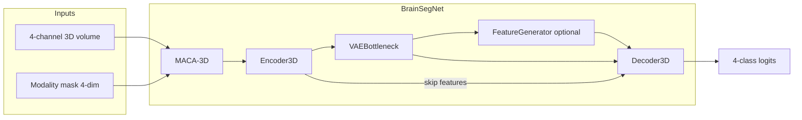

# BrainSegNet — System Architecture

This document describes the **network architecture**, **data flow**, **training stages**, and **main code layout** implemented in `dl_project_new/` (DATA 255, SJSU Spring 2026).

---

## 1. High-level pipeline



**Training** is two-stage **teacher → student**:

| Stage | Model | Typical `use_gan` | Role |
|-------|--------|-------------------|------|
| 1 — Teacher | `BrainSegNet` | `False` | All modalities present; learns strong segmentation + VAE regularizer. |
| 2 — Student | `BrainSegNet` | `True` in `train.py`, often `False` in `BrainSegNet_Full_Pipeline.ipynb` | Missing modalities via mask; optional GAN synthesizes bottleneck features; **knowledge distillation** from frozen teacher logits. |

Checkpoints: `TEACHER_CKPT` / `STUDENT_CKPT` under `OUTPUT_DIR/checkpoints/` (see `config.py`).

---

## 2. `BrainSegNet` module graph

Implemented in `models/brainsegnet.py`. Default hyperparameters from `config.py`: `BASE_FILTERS=32`, `CROP_SIZE=96`, `LATENT_DIM=128`, `beta_vae=0.1`.

### 2.1 MACA-3D (`models/maca.py`)

- **Input:** `x` `[B, 4, D, H, W]`, `modality_mask` `[B, 4]`.
- **Role:** Modality-aware channel reweighting (small MLP + uncertainty branch); output same shape as `x`.
- **Parameters:** on the order of hundreds (lightweight front-end).

### 2.2 Encoder3D (`models/encoder.py`)

- **DenseBlock3D:** two `Conv3d → BN → ReLU` stages with concatenation (dense-style).
- **Levels:** `enc1` → pool → `enc2` → pool → `enc3` → pool → `enc4` → pool → `bottleneck`.
- **Channel width (f = base_filters):**  
  `4 → f → 2f → 4f → 8f → 16f` feature maps at successive resolutions.
- **Outputs:**  
  - `bottleneck` tensor `[B, 16f, D/16, H/16, W/16]` (for `CROP_SIZE=96`, spatial **6×6×6**).  
  - `skips` list `[e4, e3, e2, e1]` (high→low resolution) for the decoder.

### 2.3 VAEBottleneck (`models/vae.py`)

- Flattens bottleneck spatial volume → linear **`μ`** and **`log σ²`** → latent **`z`** (`LATENT_DIM`, default 128) → decode linear → reshape to `[B, 16f, sp, sp, sp]` → `1×1×1` conv refine.
- **KL term:** `beta_vae * KL(N(μ,σ²) || N(0,I))` (used in losses / total objective).

### 2.4 Optional GAN branch (`models/gan.py`)

When `use_gan=True` and `training=True`:

- **FeatureGenerator:** concatenates `z` and `modality_mask`, MLP to spatial feature volume, 3D conv refine → **`gen_out`**.
- **Fusion:** `merged = 0.5 * (vae_out + gen_out)`.
- **PatchGANDiscriminator:** 3D patch discriminator on `f*16` channels (used in student training in `train.py`).

When `use_gan=False`, `merged = vae_out` and no discriminator parameters exist.

### 2.5 Decoder3D (`models/decoder.py`)

- **Four** `DecoderBlock3D` stages: `ConvTranspose3d` upsample ×2, **attention gate** on skip connection, then two `Conv3d` blocks.
- **Deep supervision:** auxiliary heads **`aux3`**, **`aux2`** at coarser scales; **`main`** is `1×1×1` conv to `n_classes=4` (BraTS remapped labels 0–3).
- **Training forward** returns `(main, aux3, aux2, kl, gen_out, bottleneck)`; **inference** returns `main` logits only.

---

## 3. Data layer

**File:** `dataset.py`

- **Source:** BraTS-style folders under `DATA_ROOT` (see `config.py`; workspace-relative or `BRAINSENET_DATA_ROOT`).
- **Loader:** `get_dataloaders()` — train/val/test splits; **`TEST_MODE`** shrinks to a few patients and fewer epochs.
- **Samples:** 3D random crops (`CROP_SIZE`), per-modality **missing simulation** (mask) for student-style training.
- **`NUM_WORKERS`:** from `config.py` / `BRAINSENET_NUM_WORKERS` (default `0` in Docker to avoid small `/dev/shm` bus errors).

---

## 4. Losses and metrics

**File:** `losses.py`

| Component | Description |
|-----------|-------------|
| **DiceLoss** | Soft Dice on one-hot targets vs softmax probabilities. |
| **CombinedSegLoss** | `α * Dice + (1-α) * CE` (default `α=0.7`). |
| **DeepSupervisionLoss** | Main + weighted aux heads (`0.3`, `0.5` on aux3, aux2 vs target). |
| **total_loss** | Seg + **`w_dis` × KL distillation** (student logits vs teacher softmax at temperature **`T`**) + **`w_vae` × KL`** + **`w_gan` × L1(gen_feat, enc_feat)`**. |

**Metrics:** `dice_brats` — **WT**, **TC**, **ET** regions; optional **Hausdorff 95** in evaluation utilities.

**Teacher (typical notebook / `train.py` stage 1):** deep supervision + small weight on VAE KL (e.g. `0.05 * kl` in `train.py`).

**Student (`train.py` stage 2):** discriminator step on real VAE vs fake generator features, then student step with `total_loss` and frozen teacher forward.

---

## 5. Training scripts vs notebook

| Entry | Purpose |
|-------|---------|
| **`train.py`** | CLI: `python train.py --mode teacher` or `--mode student`. Teacher `use_gan=False`; student **`use_gan=True`** with discriminator updates. |
| **`BrainSegNet_Full_Pipeline.ipynb`** | End-to-end lab notebook; teacher/student cells may set **`use_gan=False`** (“GAN disabled”) while still using distillation from teacher logits where coded. |
| **`evaluate.py`** | Loads student checkpoint and runs evaluation on test split. |

---

## 6. File map (models + core)

```
dl_project_new/
  config.py           # Paths, hyperparameters, checkpoints
  dataset.py          # BraTS2020Dataset, get_dataloaders, splits
  losses.py           # Segmentation, distillation, metrics
  train.py            # Two-stage CLI training
  evaluate.py         # Held-out evaluation
  models/
    brainsegnet.py    # Full model assembly + forward
    maca.py           # MACA-3D
    encoder.py        # Dense 3D encoder + skips
    vae.py            # VAE bottleneck
    decoder.py        # Attention U-Net decoder + deep supervision
    gan.py            # Feature generator + PatchGAN (optional)
```

---

## 7. Configuration reference (architecture-related)

From `config.py` (defaults; see file for env overrides):

- `CROP_SIZE`, `BATCH_SIZE`, `CROPS_PER_PATIENT`, `MISSING_PROB`
- `BASE_FILTERS`, `LATENT_DIM`
- `TEACHER_EPOCHS`, `STUDENT_EPOCHS` (or `TEST_EPOCHS` when `TEST_MODE`)
- `DATA_ROOT`, `OUTPUT_DIR`, derived `CHECKPOINT_DIR`, `LOG_DIR`

---

*Generated from the current `dl_project_new` source tree.*
